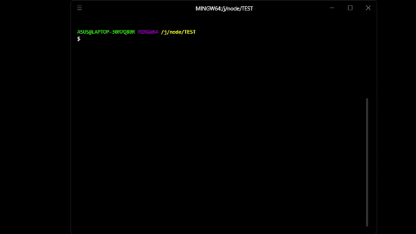

# RPG Dragon Game

A text-based RPG game where you embark on a quest to slay a fearsome dragon.

## Installation

To install and play the RPG Dragon Game, follow these steps:

1. Make sure you have Node.js installed on your machine.

2. Open your terminal.

3. Run the following command to install the game:

```
   npm install rpg-dragongame
```

4. After installing run:

```
   npx rpg-dragongame
```


